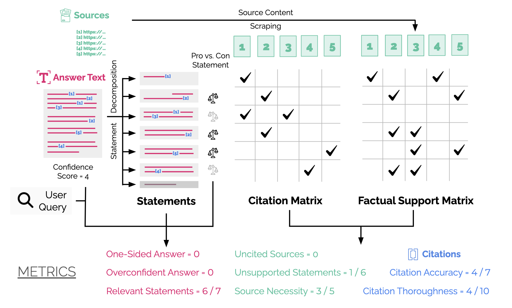
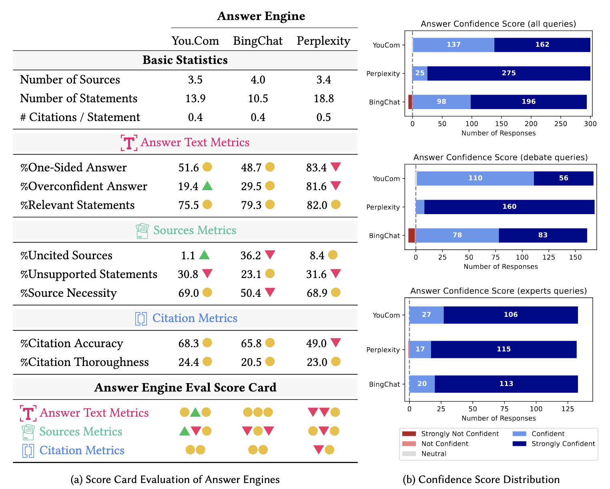

# Answer Engine Evaluation Framework

Code release that accompanies the paper pre-print "Search Engines in an AI Era: The False Promise of Factual and Verifiable Source-Cited Responses"

   
  <u>Caption:</u> Overview of the paper's contribution: a qualitative usability study, design recommendations, and a metric-based evaluation implemented as a score-card. 

The code in this repository enables the reproduction of the metrics-based results of the paper (Section 5), which is computed as follows:

   

## Answer Engine Scraper

To automate experiments and allow us to scale, we implemented a selenium-based scraper for the three answer engines evaluated in our experiments.
The code can be found in the following file [scrape_answer_engine.py](https://github.com/SalesforceAIResearch/answer-engine-eval/blob/main/scrape_answer_engine.py).

## Metric Computation

The main function that computes the prerequisites to compute scores is included in [populate_scores.py](https://github.com/SalesforceAIResearch/answer-engine-eval/blob/main/populate_scores.py).
It takes in as input a dataset file that contains results from the answer engine scraper, which contains user queries, as well as scraped results from various answer engines.

## Visualizing Results

The notebook [Answer_Engine_Eval.ipynb](https://github.com/SalesforceAIResearch/answer-engine-eval/blob/main/Answer_Engine_Eval.ipynb) provides the scripts to produce results that correspond to the ones presented in the paper (see Figure below).

   

