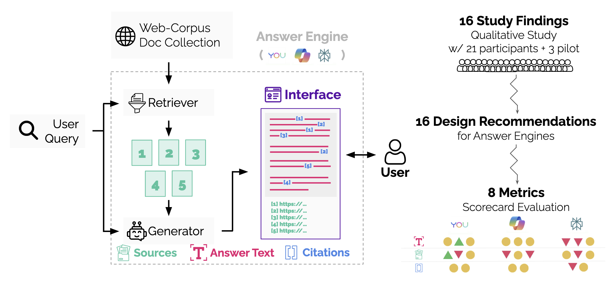
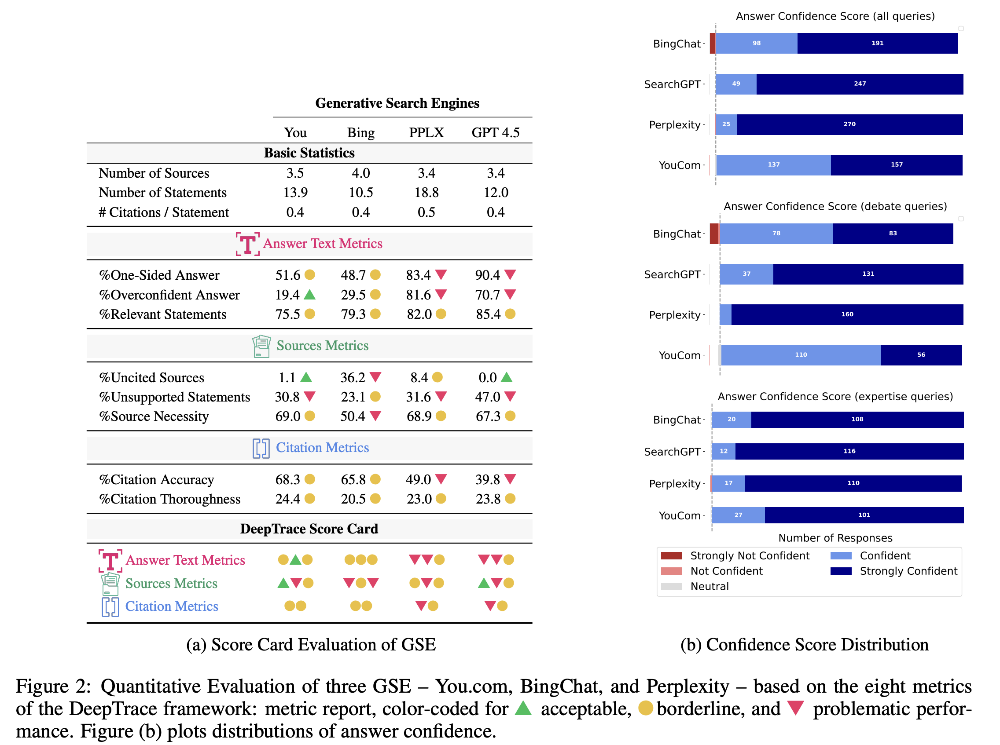
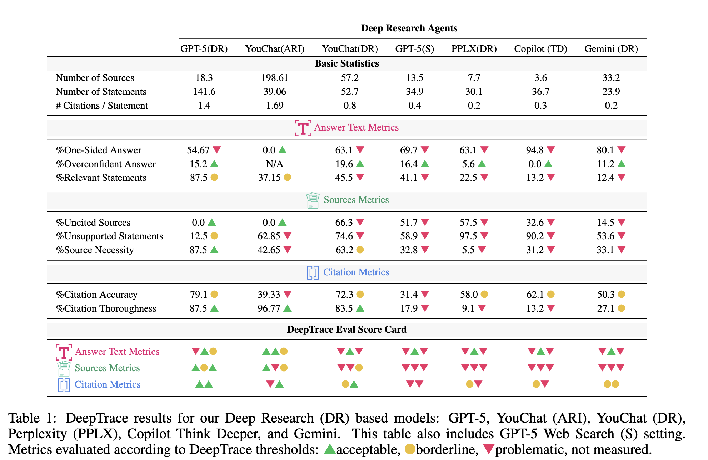
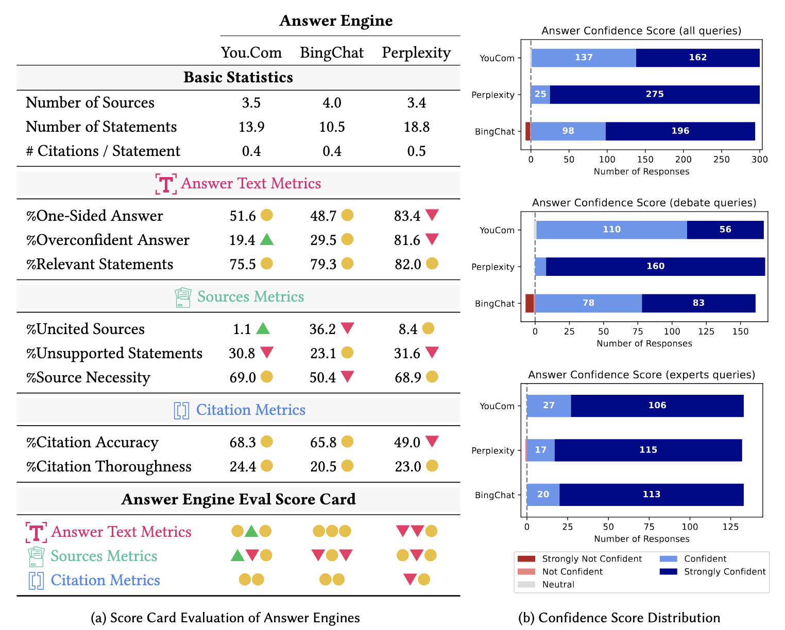

# Answer Engine Evaluation Framework

This repository provides the official code release accompanying the following works:

1. **[Search Engines in the AI Era: A Qualitative Understanding of the False Promise of Factual and Verifiable Source-Cited Responses in LLM-based Search](https://dl.acm.org/doi/abs/10.1145/3715275.3732089)**  
   *Proceedings of the 2025 ACM Conference on Fairness, Accountability, and Transparency (FAccT 2025).*

2. **[DeepTRACE: Auditing Deep Research AI Systems for Tracking Reliability Across Citations and Evidence](https://arxiv.org/abs/2509.04499)**  
   *(Currently under review.)*

> **Note:** Data in this work is provided strictly for **research purposes only**.

---

   
  <u>Caption:</u> Overview of the contributions: a qualitative usability study, design recommendations, and a metric-based evaluation implemented as a scorecard.

---

## Benchmarking and Evaluation

This framework enables the reproduction of the metrics-based results introduced in the **DeepTRACE benchmark**, covering both generative search engines and deep research models.

**Generative Search Engines**  

   

**Deep Research Models**  

   

## Metric Computation

The main function that computes the prerequisites to compute scores is included in [populate_scores.py](https://github.com/SalesforceAIResearch/answer-engine-eval/blob/main/populate_scores.py).
It takes in as input a dataset file that contains user queries, as well as scraped results from various answer engines (e.g., [data/ans_eng_eval_0.1.json](https://github.com/SalesforceAIResearch/answer-engine-eval/blob/main/data/ans_eng_eval_0.1.json)).

## Visualizing Results

The notebook [Answer_Engine_Eval.ipynb](https://github.com/SalesforceAIResearch/answer-engine-eval/blob/main/Answer_Engine_Eval.ipynb) provides the scripts to produce results that correspond to the ones presented in the paper (see Figure below).

   

## Citation

1. Venkit, Pranav Narayanan, et al. "Search Engines in the AI Era: A Qualitative Understanding to the False Promise of Factual and Verifiable Source-Cited Responses in LLM-based Search." Proceedings of the 2025 ACM Conference on Fairness, Accountability, and Transparency. 2025.

2. Venkit, Pranav Narayanan, et al. "DeepTRACE: Auditing Deep Research AI Systems for Tracking Reliability Across Citations and Evidence." arXiv preprint arXiv:2509.04499 (2025).
