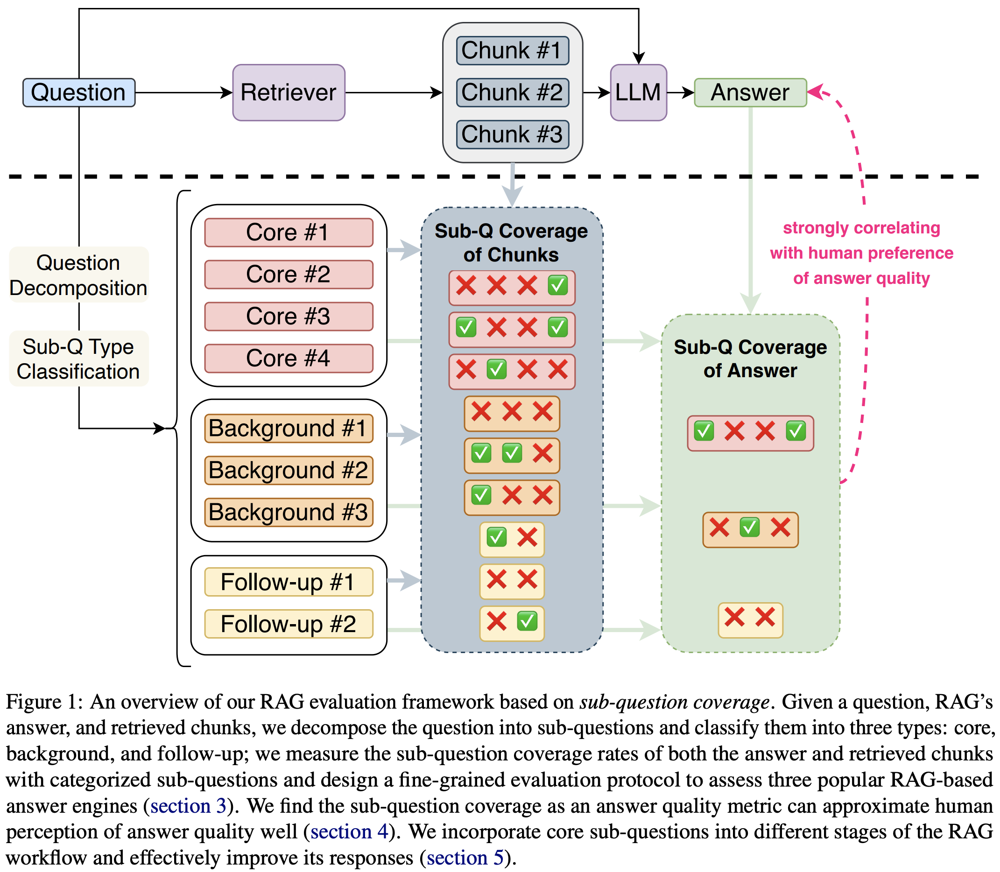

# RAG Evaluation with Sub-Question Coverage

Code release for [Do RAG Systems Cover What Matters? Evaluating and Optimizing Responses with Sub-Question Coverage
](https://arxiv.org/abs/2410.15531).

<p align="center">
  <br />
</p>

#### Sub-Question Generation

The notebook [subq_generation.ipynb](https://github.com/SalesforceAIResearch/answer-engine-eval/blob/main/Xie.et.al.2024/subq_generation.ipynb) prompts GPT-4 to come up with a comprehensive collection of relevant sub-questions that can answer the main question fully.

#### Sub-Question Type Classification

The notebook [type_classification.ipynb](https://github.com/SalesforceAIResearch/answer-engine-eval/blob/main/Xie.et.al.2024/type_classification.ipynb) prompts GPT-4 with few-shot annotated examples to classify sub-questions into three types: core, background, and follow-up sub-questions.

#### Sub-Question Coverage Measurement

The notebook [subq_coverage_measurement.ipynb](https://github.com/SalesforceAIResearch/answer-engine-eval/blob/main/Xie.et.al.2024/subq_coverage_measurement.ipynb) prompts GPT-4 with few-shot annotated examples to automatically measure the sub-question coverage.

## Citation

```bibtex
@article{xie2024rag,
  title={Do RAG Systems Cover What Matters? Evaluating and Optimizing Responses with Sub-Question Coverage},
  author={Xie, Kaige and Laban, Philippe and Choubey, Prafulla Kumar and Xiong, Caiming and Wu, Chien-Sheng},
  journal={arXiv preprint arXiv:2410.15531},
  year={2024}
}
```
